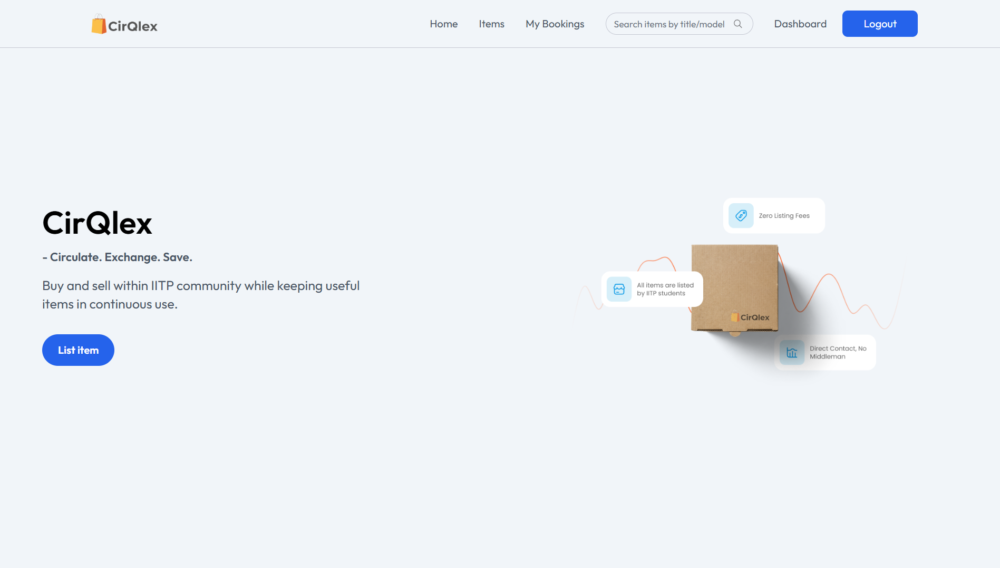
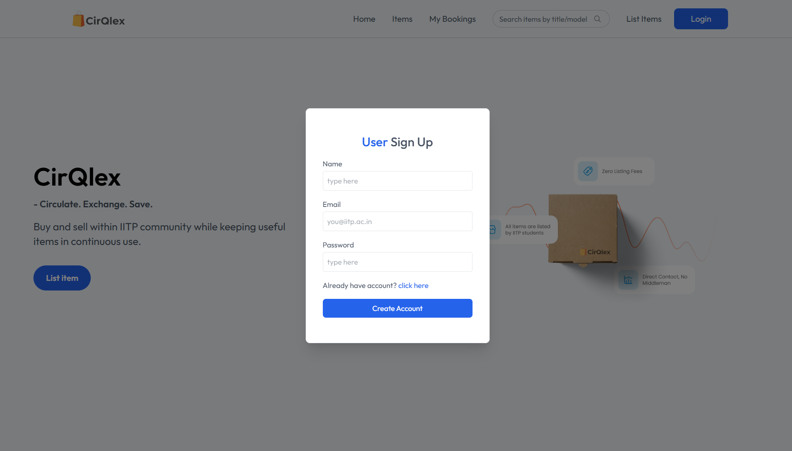
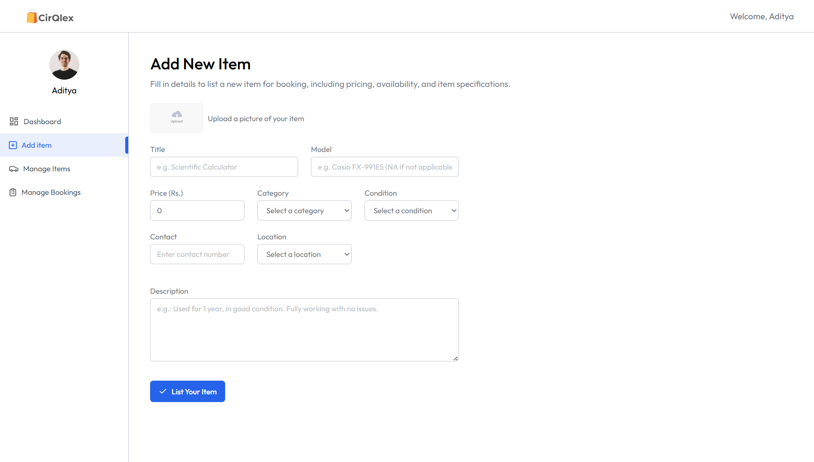
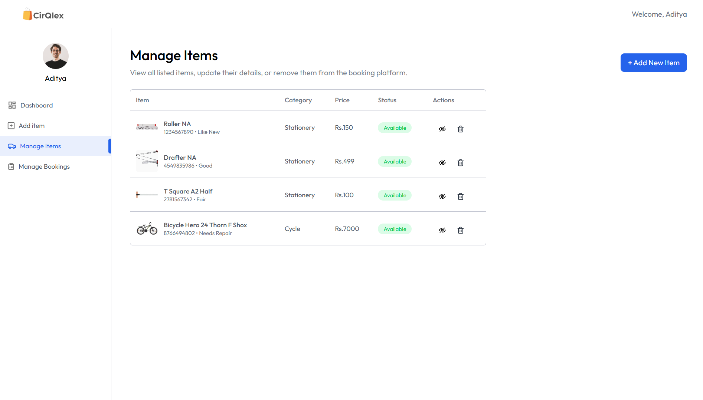
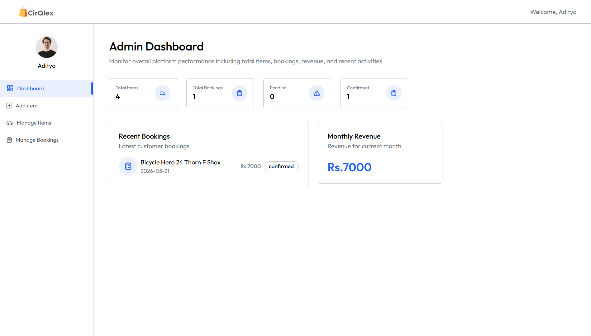
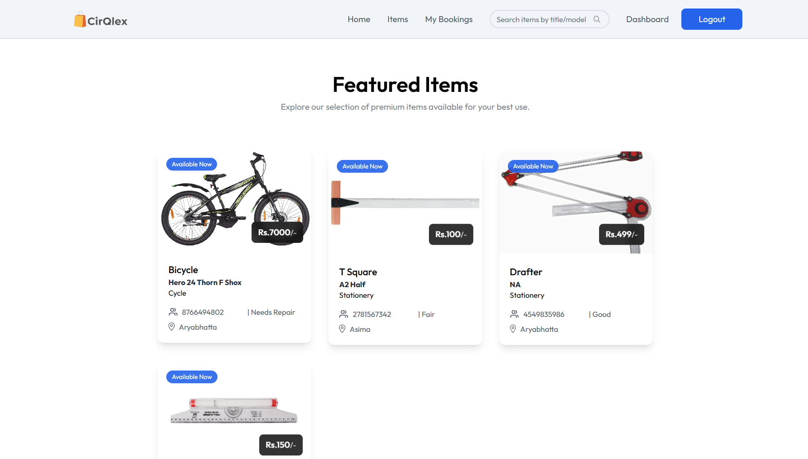

# CirQlex : Circulate. Exchange. Save.

**CirQlex** is a full-stack campus marketplace platform designed for IIT Patna students to buy and sell pre-owned items efficiently. It tackles the common issue of underutilized purchases such as engineering tools and electronics by creating a secure, student-only ecosystem for reuse and exchange.

## Live Demo

**Explore CirQlex live:**    [www.cirqlex.me](www.cirqlex.me)

---

## The Problem
Every year, hundreds of students purchase:
* **Engineering Drawing:** Drafters, T-Squares, and drawing boards (Costing ~₹1500) used only for the first year.
* **Electronics:** LAN cables, routers, and scientific calculators that are often discarded by graduating students.
* **Cycles:** A common trend where students lose interest in their bicycles after sophomore year, leading to campus clutter.

**CirQlex** provides a centralized, verified platform to buy and sell these pre-owned items at lower prices, promoting sustainability and saving money within the campus community.

## Core Features
* **Verified IITP Access:** Only users with an IITP email can list items. The platform uses a custom **OTP-based email verification** system to ensure campus safety.
* **Student Dashboard:** A centralized workspace for students to manage their listings, track bookings, and view potential buyers.
* **Admin Governance:** A specialized dashboard for platform moderators to monitor activity, manage listings, and restrict users who post inappropriate content.
* **Direct Interaction:** No middleman. Interested buyers get direct contact details to coordinate the exchange.
* **Optimized Image Handling:** Integration with **ImageKit** for fast, responsive image loading.

---

## Tech Stack

### Frontend
- **React & Vite**
- **Bootstrap:**  Modern, high-performance UI components.
- **Tailwind CSS 4.0:** Styling with the latest utility-first framework.
- **Motion (Framer Motion):** Smooth animations for user experience.
- **React Hot Toast:** Real-time feedback and notifications.

### Backend
- **Node.js & Express 5:** Robust server-side logic and API routing.
- **MongoDB Atlas:** Scalable NoSQL cloud database using Mongoose.
- **JWT & Bcrypt:** Secure authentication and industry-standard password hashing.
- **Nodemailer:** Automated OTP delivery for identity verification.
- **ImageKit & Multer:** Cloud storage and efficient image processing.

---

## Screenshots

| Home Page | Login | Create Listing |
|----------|-------|---------------|
|  |  |  |

| Manage Items | Dashboard | Featured Items
|-------------|-------------|-------------|
|  |  |  |

## Installation & Setup

All dependencies are managed via `package.json`. To run this project locally, follow these steps:

### 1. Clone the Repository
```bash
git clone https://github.com/Aditya-satpute/CirQlex.git
cd cirqlex
```


### 2. Configure Backend

Navigate to the server directory and install modules:

```bash
cd server
npm install
```

Create a .env file in the /server folder and add your credentials:

```bash
PORT=5000
MONGO_URI=your_mongodb_connection_string
JWT_SECRET=your_jwt_secret
EMAIL_USER=your_gmail@gmail.com
EMAIL_PASS=your_app_password
IMAGEKIT_PUBLIC_KEY=your_key
IMAGEKIT_PRIVATE_KEY=your_key
IMAGEKIT_URL_ENDPOINT=your_endpoint
```


### 3. Configure Frontend
Navigate to the client directory and install modules:

```Bash
cd ../client
npm install
```

Create a .env file in the /client folder:

```Bash
VITE_CURRENCY=Rs.
VITE_BASE_URL=http://localhost:3000
```

### 4. Run the Application
You will need two terminal windows open:

Terminal 1 (Backend):

```Bash
cd server
npm run server
```

Terminal 2 (Frontend):

```Bash
cd client
npm run dev
```

---

## Future Scope

- [ ] Lost & Found: A dedicated module for reporting lost campus items  
- [ ] In-App Messaging: Secure chat between buyer and seller  
- [ ] Category Filters: Enhanced search for specific hostels or departments  

---

## Contact

[Email](mailto:aditya.iitpatna@gmail.com) | [LinkedIn](https://www.linkedin.com/in/aditya-satpute-b46831291/) | [GitHub](https://github.com/Aditya-satpute)


Built with ❤️ for the IITP Community.
